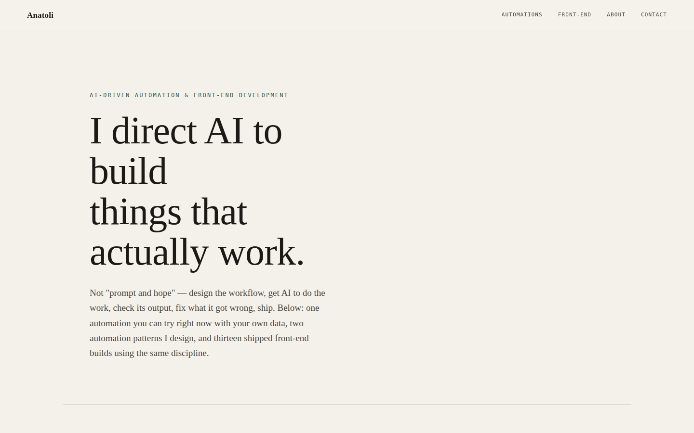

# Portfolio — Anatoli

Live: https://anatolilavra-droid.github.io/Portfolio/



A hub site with two things in it: **automations** (AI directed to do real,
verifiable work — one live tool you can run with your own data, plus two
reference automation patterns) and **front-end builds** (13 shipped
landing pages, each with the live site, source, and a specific real
problem that came up building or shipping it). Plain HTML/CSS/JS, no
framework, no build step.

Deliberately styled differently from the front-end projects it links to
(warm paper background, serif type, restrained motion) so it reads as the
index, not another entry in the collection.

## Structure

```
portfolio/
├── index.html          # page shell — hero, automations, about, work grid, contact
├── style.css             # all styles
├── script.js              # renders front-end project cards from projects.js + scroll reveal
├── triage.js               # Inbox Triage tool logic (sample mode + live Claude API mode)
├── projects.js               # front-end project data — one entry per shipped site
├── assets/previews/            # one compressed screenshot per front-end project
└── docs/
    └── preview.png
```

## The Inbox Triage tool

A small, genuinely-working automation, not a mockup: paste a batch of
inbound messages (or click "Load sample inbox") and get each one
categorized, scored for urgency, and given a drafted reply.

- **Sample mode** — pre-computed results, works instantly, no API key.
- **Live mode** — calls the Anthropic API directly from the browser with a
  key you supply. The key is only ever held in the input field's memory:
  never written to `localStorage`, never sent anywhere except straight to
  `api.anthropic.com`. There is no backend here to send it to.

## Updating

New front-end projects go in the `PROJECTS` array in `projects.js` —
title, tagline, image, live/repo links, tags, and a `problem` field
describing what was actually debugged or built. Drop a screenshot into
`assets/previews/` and the card renders automatically.

## License

MIT — see [LICENSE](LICENSE). Linked projects each carry their own license.
